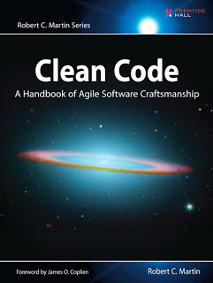

= Clean Code

[cols="1,5", frame="none"]
|===
||Programmers create problems for themselves when they write code solely to satisfy a compiler or interpreter.

Have you ever been significantly impeded by bad code? If you're a programmer if any experience then you've felt this impediment many times. Indeed, we have a name for it "wading".

|===

== Attitude

Most managers want good code, even when they are obsessing about the schedule. They may defend the schedule and requirements with passion; but that's their job. It's our job to defend the code with equal passion.

To drive this point home, what if you were a doctor and had a patient who demanded that you stop all the silly hand-washing in preparation for surgery because it was taking too much time? Clearly the patient is the boss; and yet the doctor should absolutely refuse to comply. Why? Because the doctor knows more than the patient about the risks of disease and infection. It would be unprofressional (never mind criminal) for the doctor to comply with the patient.

So too is unprofessional for programmers to bend to the will of managers who don't understand the risks of making messes.

== LeBlanc's Law

Why we wrote bad code?, Were you trying to go fast? Were you in a rush? Probably so. Perhaps you felt that you didn't have time to do a good job; that you boss would be angry with you if you took the time to clean up your code. We've all felt the relief of seeing our messy program work and deciding that a working mess is better than nothing. We've all said we'd go back and clean it up later. Of course, in those days we didn't know LeBlanc's law: Later equals never.

== Kent Beck Rules

* Run ALL the tests
* Contains no duplication
* Express ALL the design ideas that are in the system
* Minimizes the number of entities (classes, methods, functions)

== Functions

* Too many arguments
The ideal number of arguments in a function is zero (niladic). Next comes one (monadic), followed closely by two (dyadic). Three arguments (triadic) should be avoided where possible. More than three (polyadic) requires very special justification and then shouldn't be used anyway.
* Flag arguments
Flag arguments are ugly. Passing a boolean into a function is a truly terrible practice. It immediately complicates the signature of the method, loudly proclaiming that this function does more than one thing.
* Dead functions
Methods that are never called should be discarded. Keeping dead code around is wasteful. Don't be afraid to delete the function, your source code control system still remembers it.

== Commented-Out Code

Few practices are as odious as commenting-out code. Don't do this!.

----
// InputStream resultsStream = formatter.getResultStream();
// StreamReader reader = new StreamReader(resultsStream);
// response.setContent(reader.read(formatter.getByteCount()));
----

Others who see that commented-out code won't have the courage to delete it. They'll think it is there for a reason and is too important to delete. So commented-out code gathers like dregs at the bottom of a bad bottle of wine.

== Quotes

* With functions we measured size by counting physical lines. With classes we use different measure. We count responsibilities.
* Wrapping particular implementations in more abstract methods, is also part to avoid duplication.
* When you're coding, you're an author and you have readers,   indeed the ratio of time spent reading vs writing is well over 10:1
* The fewer methods a class has, the better. The fewer variables a function knows about, the better. The fewer variables a class has, the better.
* Well-defined modules have very small interfaces that allow you to do a lot with a little. Concentrate on keeping interfaces very tight and very small. Help keep coupling low by limiting information.
* Before you consider yourself to be done with a function, make sure you understand how it works. Often the best way to gain this knowledge and understanding is to refactor the function into something that is so clean and expressive that it is obvious how it works.
* Boolean logic is hard enough to understand without having to see it in the context of an if or while statement. Extract functions that explain the intent of the conditional.

== Tips

* Don't return null
* Don't pass null as parameter
* Take care about quality on Junit test code
* Follow SRP (Single Responsibility Principle)
* Maintain cohesion, when classes lose cohesion split them.
* If you do something a certain way, do all similar things in the same way.
* Consider polymorphism before using a switch or if/else statements.
* Avoid negative conditionals (Negatives are just a bit harder to understand that positives) So, when possible, conditionals should be expressed as positives. For example:

----
   if(buffer.shouldCompact())
----

is preferable to

----
  if(!buffer.shouldNotCompact())
----

'''

Footer
